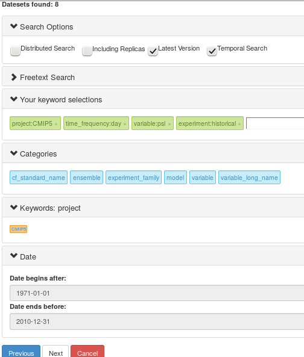
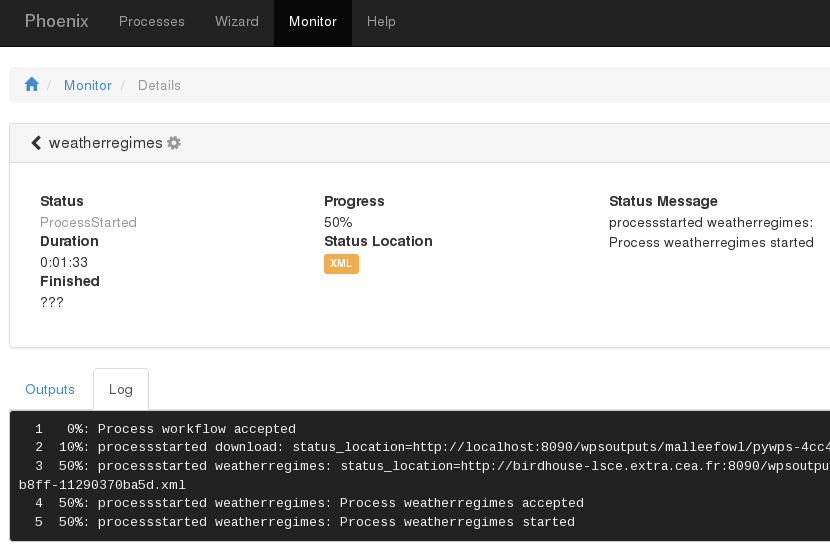

Processes:
**********

Flyingpigeon provides processes (also named as workflows ) for climate model data analysis, climate impact studies and investigations of extremes. 

Analog pressure pattern
-----------------------

CASTf90 first downloads fields from NCEP reanalysis (sea level pressure, slp, as default) and then searches in a given simulation period for the most similar cases within a given data base period according to a given distance measure. Finally, it writes the N most similar days, including their calculated distances from the reference case, to an output file.

Climate indices
---------------

Climate indices are values that describe the state the climate system for a certain parameter. Climate indices as timeseries can be used to describe or estimate the change in climte over time.

The climate indices processes in flyingpigeon are based on the `python package icclim <http://icclim.readthedocs.org/en/latest/>`_
They are subclassed to:

.. toctree::
   :maxdepth: 1
   
   indices

Climate indices have to be calculated for a time aggregation:

+-------------+-------------+---------+
|             | Time        |values   |
|             | aggregation |per year | 
+-------------+-------------+---------+
| mon         | monthly     | 12      |
+-------------+-------------+---------+
| sem         | seasonal    | 4       |          
+-------------+-------------+---------+
| yr          | yearly      | 1       |
+-------------+-------------+---------+
| ONDJFM      | winter half | 1       |
+-------------+-------------+---------+ 
| AMJJAS      | summer half | 1       |
+-------------+-------------+---------+
| DJF         | winter      | 1       |                
+-------------+-------------+---------+ 
| MAM         | Spring      | 1       |
+-------------+-------------+---------+ 
| JJA         | Summer      | 1       |
+-------------+-------------+---------+ 
| SON         | Autumn      | 1       |
+-------------+-------------+---------+ 
| JAN         | Januar      | 1       |
+-------------+-------------+---------+
   
   

Download Resources
------------------

Downloads resources (limited to 50GB) to the local file system of the birdhouse computer provider.

EOBS to CORDEX
--------------

converts EOBS data files into the CORDEX convention. (variable names, attributes, etc ... ).

extract Timeseries
------------------

Extract 1D Timeseries for specified coordinates from gridded data.

Robustness of an ensemble
-------------------------

Calculates the robustness as the ratio of noise to signal in an ensemble of timeseries.

Returntimes
-----------

Calculation of return time Values for 1D timeseries. 

Segetalflora
------------
Species biodiversity of segetal flora. Imput files: variable:tas , domain: EUR-11 or EUR-44.

Species Distribution Model
--------------------------

The process is performing the following steps:

* fetching selected data (GBIF zip file) and climate model data. 
* extraction of GBIF Data
* based on GBIF Data coordinates a presents/absence mask is generated
* calculation of selected climate indices in appropriate time aggregations
* calculation of mean values of climate indices for the given reference period
* statistical training (GAM) based on presents / absence maks and climate indices of reference period
* prediction of favourability based on traind GAM and projected as yearly timeseries for the whole proided time series
* plotting information and storing netCDF files in archive files (tar or zip)

Further reading: 

`Species Favourability Shift in Europe due to Climate Change: A Case Study for Fagus sylvatica L. and Picea abies (L.) Karst. Based on an Ensemble of Climate Models <http://www.hindawi.com/journals/jcli/2013/787250/>`_.

.. toctree::
   :maxdepth: 1
   
   ../tutorial/sdm
   
   

.. _subset_countries: 

Subset Countries 
----------------

Generates a polygon subset of input netCDF files.

Based on an ocgis call, several predfined polygons ( world counties ) can be used to generate an appropriate subset of input netCDF files. 
The option 'MOSAIK' as a checkbox allows you to decide, in the case of multiple polygon selection, if the polygons should be stitched together into one polygon (e.g. shape of Germany and France as one polygon) or calculated as separate output files. 

For optimisation of the subset process, the appropriate shapefiles are prepared as follows: 

.. toctree::
   :maxdepth: 1

   shapefilepreparation
   
.. _visualisation: 

Visualisation
-------------

Time series visualisation of netCDF files. 
Creates a spaghetti plot and an uncertainty plot.

.. _weatherregimes:

Weather Regimes
---------------

Calculation of weatherregimes based on pressure patterns (kmean method). The processes is performing a pattern clusterfication for observations data ( NCEP ) as well as to model data. both results are compared
 
Method:
.......

* fetching observation data 
* fetching model data
* subset the selected geographical region 
* selection of month to be analyzed
* unit conversion to hPa (if necessary)
* regridding (biliniar) to the grid of observation (if necessary)
* comuting of pricipal componets for dimension reduction

Process Arguments:
..................

* resources (links to netCDF sea surface pressure data) 
* or search with phoenix

Inputs:
.......

* NCEP slp data (automatic fetch)
* any kind of surface pressure data (netCDF files in cf convention). Multiple Datasets slized in seperate files possible

Outputs: 
........

* scatter plot showing the centoides of the clusters and the appropriate centroids of each timestep
* maps for each weather regime of all input datasets. including comparison statistics with observation pattern
* tar archive containing text files with date time , weatherregime table

Example PYTHON call:
....................

`Asyncron Link creation <https://github.com/bird-house/flyingpigeon/blob/master/notebooks/WPS_weatherregimes.ipynb>`

Example with Phoenix (GUI):
...........................

- login to a Phoenix GUI (e.g. `Compute provider mouflon at DKRZ <https://mouflon.dkrz.de/>`_) 

- Menu option: Wizard
- Choose a Favorite: No Favourite 
- Choose a Web Processing Service: Flyingpigeon 
- Choose WPS Process of Flyingpigeon: Weather Regimes
- Literal inputs of Weather Regimes: given is a default, feel free to change ;-) 
- Choose Input Parameter of Weather Regimes: netCDF
- Choose Data Source : Earth System Grid (ESGF) 
            
The next window is the Data search interface to the available data of the ESGF archive. Weather regimes are computed based on sea surface pressure values. The appropriate variable for CMIP5 data are 'psl'. With other search options the dataselection shoule look like this example: 

You can save your settings as favourite. And submit the job.  
Done!!!

You follow the log file of your in the monitor (klick on the job ID e.g. a4aa98de-ffde-11e5-b50a-bb0d01b14483). manual reload of your browser site is necessary.

