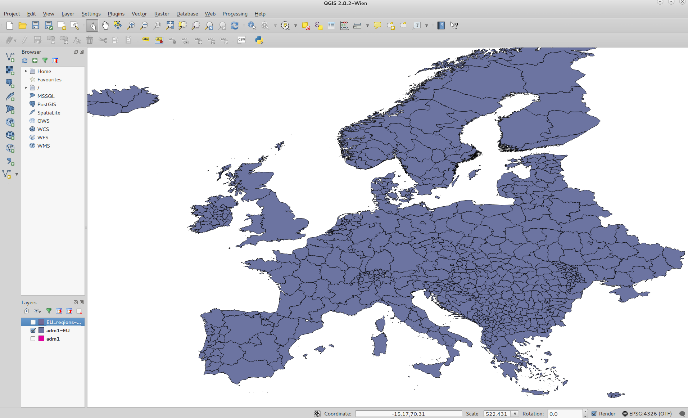
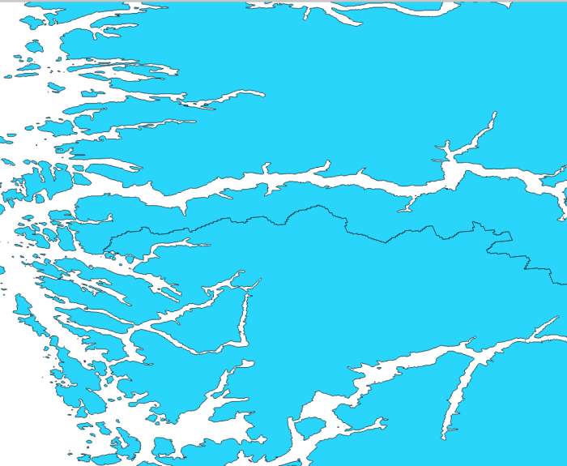
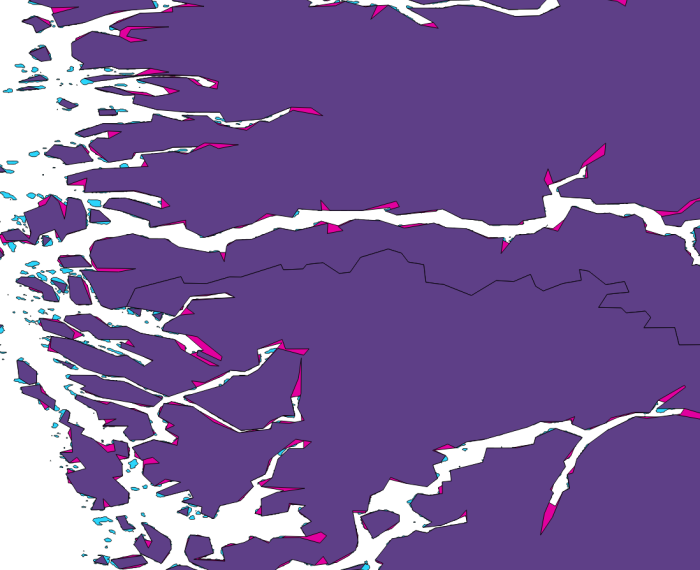
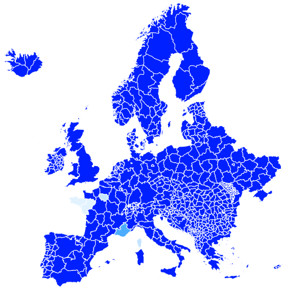
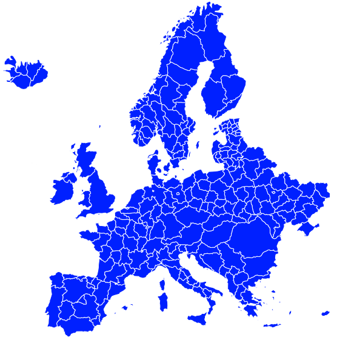

Shapefile preparation
========================

This text describes how to prepare, simplify and customize shapefiles from the `GADM database <http://www.gadm.org/>`_. We used GADM version 2.7.

Start by downloading gadm26_levels.gdb, the ESRI shapefile for the `whole world that contains all six administration levels <http://www.gadm.org/version2>`_. The resulting file is a directory that can be read with qgis 2.8. (Note: for Fedora users, you must have Fedora 22 in order to upgrade to qgis 2.8).

Open shapefile in qgis
======================

To open gadm26_levels.gdb in qgis, follow the steps below:

Add Vector Layer ->

………Source type = Directory

………Source:

………………Type: OpenFileGDB

After selecting the directory, select "Open" and a window will appear listing the six levels. Select the level you would like. We used "adm1" which corresponds to the region level (i.e. one level smaller than country level).

Filter the countries you wish to retain
========================================

You can use qgis to select countries you wish to extract from the world shapefile. Use the "Advanced Filter (Expression)" option in the Attribute Table. For example, for a selection of EU countries, you can use this expression:

    « ISO » LIKE ‘%AUT%’ OR  « ISO »  LIKE ‘%BEL%’ OR « ISO »  LIKE ‘%BGR%’ OR « ISO »  LIKE ‘%CYP%’ OR « ISO »  LIKE ‘%CZE%’ OR « ISO »  LIKE ‘%DEU%’ OR « ISO »  LIKE ‘%DNK%’ OR « ISO »  LIKE ‘%ESP%’ OR « ISO »  LIKE ‘%EST%’ OR « ISO »  LIKE ‘%FIN%’ OR « ISO »  LIKE ‘%FRA%’ OR « ISO »  LIKE ‘%GBR%’ OR « ISO »  LIKE ‘%GRC%’ OR « ISO »  LIKE ‘%HUN%’ OR « ISO »  LIKE ‘%HRV%’ OR « ISO »  LIKE ‘%IRL%’ OR « ISO »  LIKE ‘%ITA%’ OR « ISO »  LIKE ‘%LVA%’ OR « ISO »  LIKE ‘%LTU%’ OR « ISO »  LIKE ‘%LUX%’ OR « ISO »  LIKE ‘%MLT%’ OR « ISO »  LIKE ‘%NLD%’ OR « ISO »  LIKE ‘%POL%’ OR « ISO »  LIKE ‘%PRT%’ OR « ISO »  LIKE ‘%ROU%’ OR « ISO »  LIKE ‘%SVK%’ OR « ISO »  LIKE ‘%SVN%’ OR « ISO »  LIKE ‘%SWE%’ OR « ISO »  LIKE ‘%NOR%’ OR « ISO »  LIKE ‘%CHE%’ OR « ISO »  LIKE ‘%ISL%’ OR « ISO »  LIKE ‘%MKD%’ OR « ISO »  LIKE ‘%MNE%’ OR « ISO »  LIKE ‘%SRB%’ OR « ISO »  LIKE ‘%MDA%’ OR « ISO »  LIKE ‘%UKR%’ OR « ISO »  LIKE ‘%BIH%’ OR « ISO »  LIKE ‘%ALB%’ OR « ISO »  LIKE ‘%BLR%’ OR  « ISO » LIKE ‘%XKO%’

The Attribute Table will then be updated and you can choose all the rows. This selection will be displayed on the map in the main window of qgis:

You can save this selection in the format of an ESRI Shapefile:

Layer -> Save as -> Save only selected features   

Simplify using mapshaper (command line)
=======================================

Note that the resulting map is very highly resolved, and it is often necessary to simplify the lines. There is an online tool called `mapshaper <https://github.com/mbloch/mapshaper/wiki/Command-Reference>`_ that we found to be very effective. It can be used both on the command line and as a web GUI.

On the command line, the default options are: Visvalingam Weighted Area, no Snap Vertices.
Choose the simplification level, the input and output shapefiles. Here is an example for 1% simplification:

$ mapshaper -i adm1-EU.shp -simplify 1% -o adm1-EU-mapshaped1.shp

=> Repaired 98 intersections; unable to repair 1 intersection.

This produced a simplified map, shown here (purple) superimposed on the original map (blue), zoomed on the coastline of Norway:

.. image:: ../pics/Norway_mapshaper_commandline.png
   :alt: alternate text
   :align: center

Simplify using mapshaper (GUI)
==============================

Ÿou can test the different simplify options using the `mapshaper GUI <http://www.mapshaper.org/>`_ instead of the command line version. Namely:

Visvalingam Weighted Area | Effective Area

Snap Vertices ON | OFF

Also, the GUI seems to be more successful at repairing all intersections.

The figure below shows the original (cyan), NoSnapVertices-WeightedArea (magenta), and NoSnapVertices-EffectiveArea (purple):

.. image:: ../pics/Norway_cyan.png
   :alt:
   :align: center

(There were very tiny differences between Snap Vertices vs. No Snap Vertices. Too hard to say from this example if one was better than the other).

Customize shapefile
====================

The shapefile produced from the adm1 level of the ESRI shapefile as described above shows all regions of the selected countries, but when displayed on the screen, some regions were too small both visually and for the resolution of our models (~100km):

Another issue with using the ESRI file containing all six admin levels is that there is no unique identifier column such as "HASC_1". For example, for the region Homyel’ (with a ‘ at the end) in Belarus,  "HASC_1" = "BY.HO". Without this field, one would be forced to use "NAME_1" = "Homyel’" to identify this region, but the special character ‘ may cause problems in the python script that reads the file.

So, we need to merge the small country regions together while leaving the larger regions alone.

Steps:

1. We downloaded the GADM shapefile as a single layer (`here <http://www.gadm.org/version2>`_), and the EU countries were selected as before.

   Note: HASC_1" was NULL for some countires, e.g. FRA, ITA, GBR, BEL. We manually replaced the NULLs with a unique identifier following the convention in the file.

2. We then decided which regions to merge together, and then we formed the following qgis filter expression:

   « ISO » LIKE ‘%CYP%’ OR  « ISO »  LIKE ‘%IRL%’ OR « ISO »  LIKE ‘%MDA%’ OR « ISO »  LIKE ‘%BGR%’ OR « ISO »  LIKE ‘%XKO%’ OR « ISO » LIKE ‘%CHE%’ OR  « ISO »  LIKE ‘%LIE%’ OR « ISO »  LIKE ‘%DNK%’ OR « ISO »  LIKE ‘%HRV%’ OR « ISO »  LIKE ‘%BIH%’ OR « ISO » LIKE ‘%SRB%’ OR  « ISO »  LIKE ‘%PRT%’ OR « ISO »  LIKE ‘%MNE%’ OR « ISO »  LIKE ‘%ALB%’ OR « ISO »  LIKE ‘%MKD%’ OR « ISO » LIKE ‘%NLD%’ OR  « ISO »  LIKE ‘%SVN%’ OR « ISO »  LIKE ‘%MDA%’ OR « ISO »  LIKE ‘%LUX%’ OR « ISO »  LIKE ‘%MLT%’ OR « ISO »  LIKE ‘%LIE%’ OR « ISO »  LIKE ‘%BIH%’ OR « ISO »  LIKE ‘%ROU%’ OR « ISO »  LIKE ‘%AUT%’ OR « ISO »  LIKE ‘%CZE%’ OR « ISO »  LIKE ‘%SVK%’ OR « ISO »  LIKE ‘%HUN%’

3. In the main screen of qgis, these selected countries were regrouped with respect to field "ISO" (i.e. country level):

   Vector -> Geoprocessing tools -> Dissolve -> Dissolve field = ISO

4. The other countries (whose regions are large enough to be resolved) were selected in the Attribute Table in the same way, but using ID_1 (corresponding to level adm1) as the identifier.

5. Finally, the two shapefiles were fused together:
   
   Vector -> Data Management Tools -> Merge shapefiles to one

6. The resulting shapefile was simplified with the `mapshaper GUI <http://www.mapshaper.org/>`_ at 0.1%, which can then be read into the flyingpigeon python scripts.

7. To display in the browser, the shapefile was converted to geojson using `ogr2ogr <http://www.gdal.org/ogr2ogr.html>`_:

   $ ogr2ogr -overwrite -f GeoJSON output.geojson input.shp

Here is the resulting file containing region-level and country-level areas:

