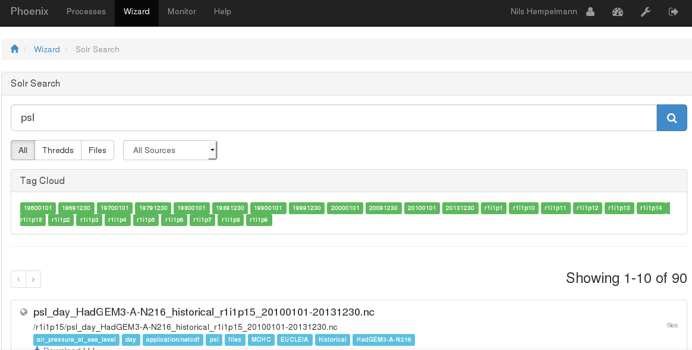

Turorials 
=========

Processing files of the local (compute providers) disc system with solr - search 
................................................................................

Note for administrators: 
To index files run: 
birdfeeder from-walker --start-dir /path/to/local/folder/

* login to a Phoenix GUI (e.g. `Compute provider DKRZ <https://mouflon.dkrz.de/>`_) 
 
- Menu option: Wizard
- Choose a Favorite: No Favourite 
- Choose a Web Processing Service: Flyingpigeon 
- Choose WPS Process of Flyingpigeon: Weather Regimes
- Literal inputs of Weather Regimes: given is a default
- Choose Input Parameter of Weather Regimes: netCDF
- Choose Data Source : Birdhouse Solr Search
            
The open window is the Data search interface to the available local data of the compute provider. Weather regimes are computed based on sea surface pressure values. Appropriable variables are 'psl' or 'slp'. In case of this example, search for 'psl':

You can save your settings as favourite. And submit the job.  
Done!!!

You follow the log file of your in the monitor (klick on the job ID e.g. a4aa98de-ffde-11e5-b50a-bb0d01b14483). manual reload of your browser site is necessary.

.. image:: pics/monitor_log_weatherregimes.png