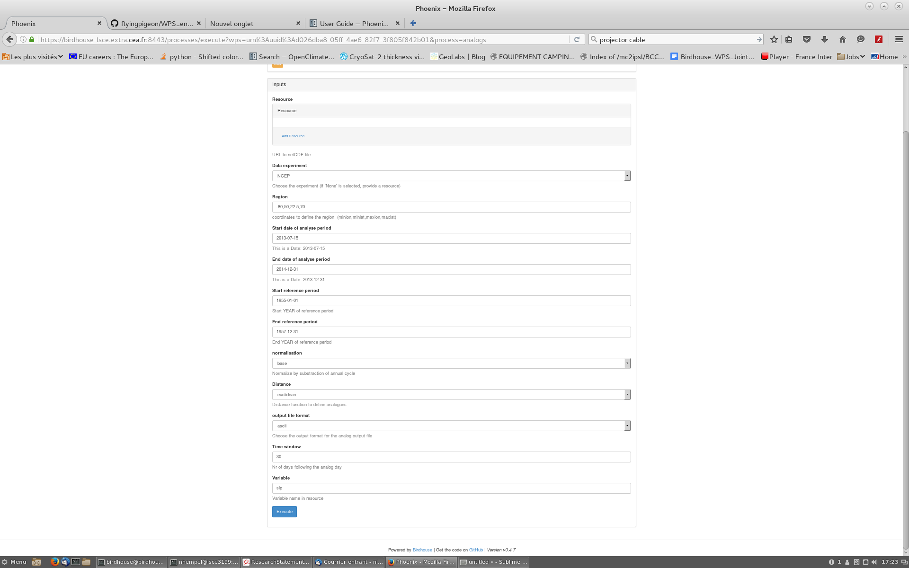

Tutorial: castf90
..................

Picking dates of analog pressure patterns in a reverence period for specific time slice. 

* login to a Phoenix GUI (e.g. `Compute provider DKRZ <https://mouflon.dkrz.de/>`_)
( `Detailed descritions for login options <http://pyramid-phoenix.readthedocs.io/en/latest/user_guide.html#login>`_ )

- Menu option: Processes
- Web Processing Services: Flyingpigeon
- Processes: Days with analog pressure pattern
- choose the approriate input parameter. 
(a resource is not necessary, NCEP data are fetched within the process)

Press execute to submit the job! 
You follow the log file of your in the monitor (klick on the info button to follow the log file). manual reload of your browser site is necessary.