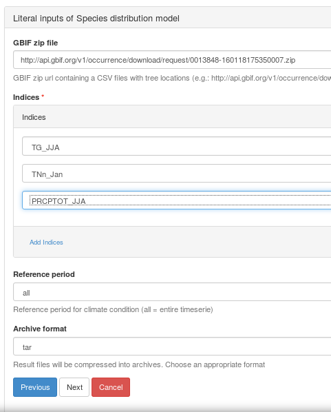
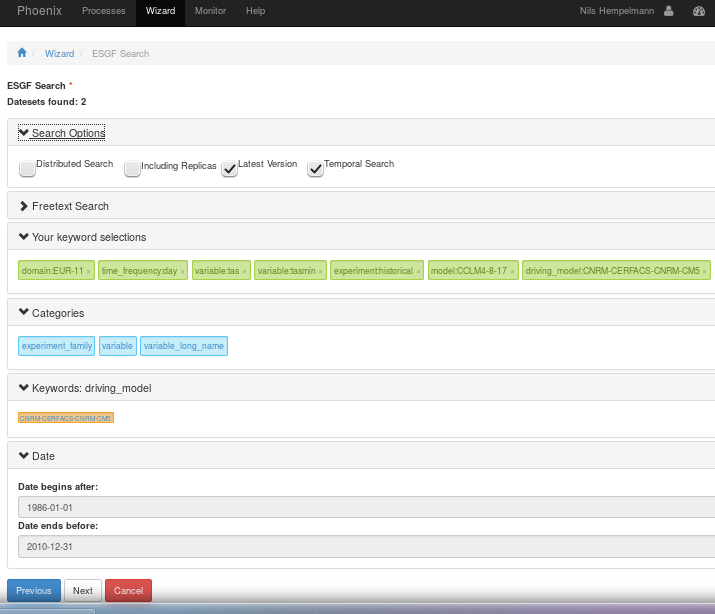

Tutorial: Species distribution model
....................................

Execution with Phoenix (web browser GUI)

1. Login to a Phoenix GUI (e.g. `Compute provider mouflon at DKRZ <https://mouflon.dkrz.de/>`_) 
2. Menu option: Wizard
3. Choose a Favorite: No Favorite 
4. Choose a Web Processing Service: Flyingpigeon 
5. Choose WPS Process of Flyingpigeon: Species distribution model (SDM) 
6. Literal inputs of species distribution model :

7. Choose Input Parameter of species distribution model: netCDF
8. Choose Data Source : Earth System Grid Federation (ESGF)
            
The next window is the data search interface to the data available in the ESGF archive. The input files are used to calculate the climate conditions. Depending on the selection of indices, appropriate variables have to be provided (e.g. an index based on precipitation needs 'pr' as an input variable ). Multiple selection can be done while pressing the Ctrl button. With other search options, the data selection looks like this example: 

10. You can optionally check or uncheck 'Save as Favorite' with an appropriate name and submit the job.  
11. Done!!!

You can follow the log file in the monitor (click on the job ID e.g. a4aa98de-ffde-11e5-b50a-bb0d01b14483). Manual reload of your browser site is necessary.
